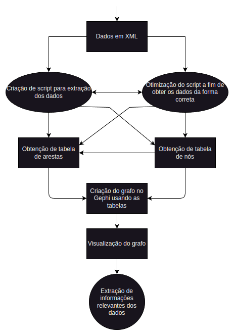

# Análise visual de dados de patentes

## Ambiente de desenvolvimento caso execute o código

1. Para criar o ambiente, digite no terminal: ```python -m venv venv```
2. Para ativar o ambiente, digite no terminal: ```source venv/bin/activate```
3. Para instalar as dependências, digite no terminal: ```pip install -r requirements.txt```
4. Para desativar o ambiente, digite no terminal: ```deactivate```

- Caso instale uma nova dependência, digite no terminal: ```pip freeze > requirements.txt```

## Grafo

Utilize o arquivo ```gephi.gephi.zip``` no Gephi para visualização do grafo gerado.

## Fluxo de desenvolvimento



## Documentação

[Ver documentação](docs/Relatório___PIBIC___Análise_Visual_de_Dados_de_Patentes.pdf)
